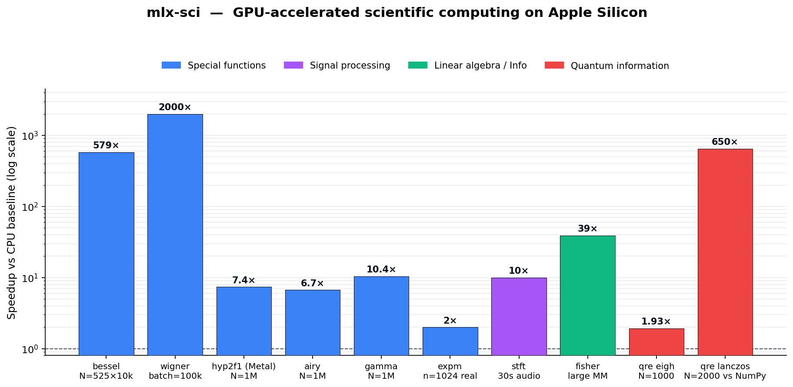

# mlx-sci

> **Quantum-information primitives + GPU special functions for Apple
> Silicon.** Stochastic Lanczos QRE, Petz recovery, Wigner symbols,
> Bessel / hypergeometric / Airy / gamma, matrix-functions, STFT —
> all native on the Metal GPU through [MLX](https://github.com/ml-explore/mlx).



*Headline speedup of each module against its CPU baseline (NumPy /
SciPy / sympy) on an Apple M1 Max. Each bar is the most representative
single number per module — see each sub-package's
`benchmark_results.md` for the full curve and break-even points.*

`mlx-sci` is a meta-package that bundles a curated set of focused
sub-packages — Airy, Bessel, Gamma, Hypergeometric, Wigner, matrix
exponential, STFT, Fisher information, quantum relative entropy, and an
optional statevector circuit simulator — under one consistent namespace
(`mlx_sci.quantum`, `mlx_sci.special`, `mlx_sci.linalg`,
`mlx_sci.signal`). Each sub-package is independently installable, so
you can either pull the whole stack or pick à la carte.

Everything runs on the Apple GPU through MLX. There is no CUDA path,
no host->device shuffling, and no framework dependency beyond MLX +
NumPy.

## Install

```bash
pip install mlx-sci         # bundles all sub-packages
pip install "mlx-sci[sim]"  # ... plus the optional circuit simulator

# or pick à la carte
pip install mlx-airy mlx-bessel mlx-expm mlx-fisher mlx-gamma
pip install mlx-hyp2f1 mlx-qre mlx-stft mlx-wigner
pip install mlx-quantum-sim   # optional, not on PyPI yet
```

Python >= 3.10, Apple Silicon (M1/M2/M3/M4), MLX >= 0.30.

## Quick Start

```python
import mlx.core as mx
from mlx_sci import quantum, special, linalg, signal

# ── Quantum information ────────────────────────────────────────────
# Quantum relative entropy via Stochastic Lanczos quadrature.
# O(k * N^2) — beats the exact eigh path by ~2 orders at N >= 1000
# and is the only path that completes at N = 2000 on the Metal GPU.
rho   = quantum.random_density_matrix(2000)
sigma = quantum.random_density_matrix(2000)
D_slq = quantum.quantum_relative_entropy_lanczos(rho, sigma, k=25, m=20)

# Exact eigh path is still available for small / batched inputs
rho_s   = quantum.random_density_matrix(256)
sigma_s = quantum.random_density_matrix(256)
D_exact = quantum.quantum_relative_entropy(rho_s, sigma_s)

# Petz recovery bound: F(rho, R o N(rho)) >= exp(-Sigma/2)
ok = quantum.verify_petz_bound(kraus, rho_s, sigma_s)   # noqa: F821

# ── Special functions ──────────────────────────────────────────────
# Wigner 3j — one million coupling coefficients in a single dispatch
N = 1_000_000
j1 = mx.ones(N);  j2 = mx.ones(N);  j3 = 2 * mx.ones(N)
m  = mx.zeros(N)
w3j = special.wigner_3j(j1, j2, j3, m, m, m)

# Airy Ai/Bi over a real grid
Ai, Ai_p, Bi, Bi_p = special.airy(mx.linspace(-15.0, 15.0, 10_000))

# Gauss hypergeometric — auto-routes to a fused Metal kernel when |z|<0.5
a = mx.array(0.5); b = mx.array(1.0); c = mx.array(1.5)
z = mx.linspace(0.01, 0.95, 1_000_000)
F = special.hyp2f1(a, b, c, z)

# Vectorised gamma / lgamma / digamma on GPU
y = special.gamma(mx.linspace(0.1, 30.0, 1_000_000))

# ── Linear algebra ─────────────────────────────────────────────────
# Matrix exponential (Pade-13 + scaling-squaring) on GPU
H = mx.random.normal((1024, 1024))
U = linalg.expm(-1j * H * 0.1)

# ── Signal processing ──────────────────────────────────────────────
# Class-based STFT layer (mlx-stft 0.1.2 API)
stft = signal.STFT(n_fft=1024, hop_length=256,
                   window=signal.hann_window(1024))
audio = mx.random.normal((480_000,))             # 30 s @ 16 kHz
spec = stft(audio)
```

## Modules at a glance

| Module                       | Source sub-package    | Scope                                     | One-liner |
|------------------------------|-----------------------|-------------------------------------------|-----------|
| `mlx_sci.special.airy`       | `mlx-airy`            | Airy Ai/Bi + derivatives                  | All four outputs in one call. |
| `mlx_sci.special.gamma`      | `mlx-gamma`           | gamma, lgamma, digamma, beta              | Vectorised on GPU. |
| `mlx_sci.special.hyp2f1`     | `mlx-hyp2f1`          | Gauss 2F1, 1F1, 0F1                       | Fused `metal_kernel` collapses ~200 MLX ops into 1 dispatch. |
| `mlx_sci.special.BesselTable`| `mlx-bessel`          | Spherical Bessel j_l(x), j_l'(x)          | Build once, evaluate over arbitrary x grids. |
| `mlx_sci.special.wigner_*`   | `mlx-wigner`          | Wigner 3j / 6j / 9j, Clebsch-Gordan       | Racah formula on GPU; millions per call. |
| `mlx_sci.linalg.expm`        | `mlx-expm`            | matrix expm / logm / sqrtm / Frechet      | Pade-13 + scaling-squaring on GPU. |
| `mlx_sci.signal.STFT`        | `mlx-stft`            | STFT / ISTFT layers + windows             | Class-based; `CompiledSTFT` for fixed-shape fusion. |
| `mlx_sci.quantum.qre`        | `mlx-qre`             | D(rho \|\| sigma), von Neumann entropy    | Exact eigh + Stochastic Lanczos quadrature. |
| `mlx_sci.quantum.petz`       | `mlx-qre`             | Petz recovery map, fidelity, retrodiction | F >= exp(-Sigma/2) verifier built in. |
| `mlx_sci.quantum.channels`   | `mlx-qre`             | Thermal / depolarizing / dephasing channels | Including the gravitational `thermal_attenuator(eta)`. |
| `mlx_sci.quantum.fisher`     | `mlx-fisher`          | Fisher information matrix, natural-grad   | Cosmology-scale J^T W J on GPU. |
| `mlx_sci.quantum.sim` *(opt)*| `mlx-quantum-sim`     | Statevector simulator, batched + noisy    | Optional extra (`pip install mlx-sci[sim]`). Ideal + WILLOW / HERON / T9 noise profiles. |

## Performance

All numbers below were measured on an Apple **M1 Max**, MLX 0.30-0.31,
NumPy 2.x, SciPy 1.16. SciPy / NumPy reference is float64 on the CPU
(Accelerate / LAPACK); MLX paths are float32 on the Apple GPU.

| Module                         | What it accelerates              | Headline speedup (M1 Max)             | Break-even |
|--------------------------------|----------------------------------|---------------------------------------|-----------|
| `mlx_sci.special.BesselTable`  | Spherical Bessel j_l (eval-only) | **579x** @ N_ell=525, N_x=10k         | N_x >= 5k (or table re-used) |
| `mlx_sci.special.airy`         | Airy Ai/Bi + derivatives         | **6.7x** @ N=1M                       | N >= ~30-50k |
| `mlx_sci.special.gamma`        | gamma / lgamma / digamma         | gamma **10.4x**, lgamma 6.4x @ N=1M   | N >= ~50k |
| `mlx_sci.special.hyp2f1`       | Gauss 2F1 (fused Metal kernel)   | **7.4x** @ N=1M                       | N >= ~100k |
| `mlx_sci.linalg.expm`          | Matrix exponential (Pade-13)     | **2.08x** real @ n=1024, **1.96x** complex @ n=256 | n >= 1024 real / n >= 256 complex |
| `mlx_sci.special.wigner_3j`    | Wigner 3j/6j/9j (Racah)          | **2000x** @ batch=1k vs sympy         | batch >= ~1k |
| `mlx_sci.signal.stft`          | STFT / mel spectrogram           | **10.0x** @ 30 s audio (16 kHz)       | duration >= ~5 s |
| `mlx_sci.quantum.fisher`       | Fisher J^T W J / large matmul    | **39x** @ 32k x 512                   | matrix size dependent |
| `mlx_sci.quantum.qre` (eigh)   | Quantum relative entropy         | **1.93x** @ N=1000                    | N >= ~500 |
| `mlx_sci.quantum.qre` (Lanczos)| QRE via Stochastic Lanczos       | **657x** @ N=2000 vs NumPy exact, **84x** @ N=1000 | N >= 1000 (exact times out at N=2000) |
| `mlx_sci.quantum.sim`          | Statevector simulator            | see sub-package README                | qubit-count dependent |

See each sub-package's `benchmark_results.md` for the full curve,
break-even points, and accuracy tables.

## Why MLX, not CUDA / NumPy?

- **Apple Silicon native.** No CUDA, no ROCm, no CPU offload dance — the
  Metal GPU on your laptop is the same one this stack is benchmarked
  on. No external dependencies beyond MLX + NumPy.
- **Lazy evaluation.** MLX builds a deferred graph; the entire
  computation is materialised once at `mx.eval` time. We exploit this
  in `mlx-qre`'s Stochastic Lanczos hot path so the whole `k`-step
  recurrence becomes a single GPU command-buffer.
- **`mx.compile` fusion.** Fusable element-wise + reduction subgraphs
  are JIT-compiled into single kernels.
- **`mx.fast.metal_kernel` for hot inner loops.** When auto-fusion
  cannot collapse a 200-op Taylor series into one dispatch, we drop in
  a hand-written Metal kernel — the 7.4x `hyp2f1` speedup over SciPy
  comes from exactly this trick (the underlying `*_metal` symbols are
  internal; users keep calling `hyp2f1`/`hyp1f1`/`hyp0f1` and the
  routing is transparent).
- **Honest about break-even.** Every sub-package documents the N below
  which SciPy on CPU still wins. We do not claim wins where we lose; we
  publish the cross-over point and recommend the right tool for the
  size.

## API stability

`mlx-sci` is at **v0.2.2**. The 0.x series is still iterating — minor
versions may add re-exports and refactor module layout. We commit to
keeping the headline functions (`airy`, `gamma`, `hyp2f1`, `expm`,
`stft`, `quantum_relative_entropy`, `MLXQuantumSimulator`) source-
compatible across the 0.x line. A v1.0 release will lock the public
surface.

## Sigma = 2 ln Q ecosystem

`mlx-qre` and `mlx-quantum-sim` are the numerical backbone for a small
constellation of physics projects organised around the identity
`Sigma = 2 ln Q`:

- `anatropic` — entropy production / second-law violation tests on
  near-term quantum hardware.
- `petz-recovery-unification` — Petz recovery map experiments and
  fidelity bounds.
- `tau-chrono` — time-symmetry / Khronon-foliation experiments on the
  IQM Tuna-9 / Tuna-17 backends.

If you only care about the numerics, you can ignore that side
entirely; the sub-packages are framework-agnostic.

## Citation

If `mlx-sci` saves you time, please cite either the meta-package or
the specific sub-package(s) you actually used:

```bibtex
@software{mlx_sci,
  author  = {Huang, Sheng-Kai},
  title   = {mlx-sci: GPU-accelerated SciPy + quantum-information for
             Apple Silicon},
  year    = {2026},
  url     = {https://github.com/akaiHuang/mlx-sci},
  version = {0.2.0},
}
```

Each sub-package (`mlx-airy`, `mlx-bessel`, `mlx-expm`, `mlx-fisher`,
`mlx-gamma`, `mlx-hyp2f1`, `mlx-qre`, `mlx-stft`, `mlx-wigner`,
`mlx-quantum-sim`) ships its own short BibTeX entry in its README; cite
the one(s) you actually exercised, not the umbrella, where the
distinction matters.

## License

MIT.
